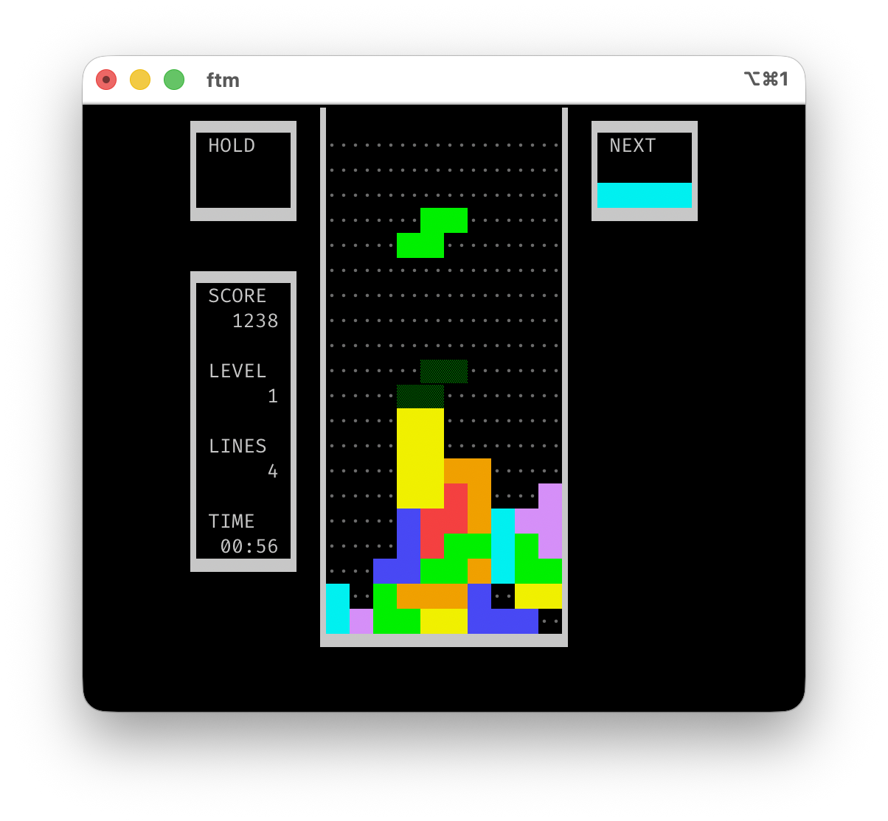
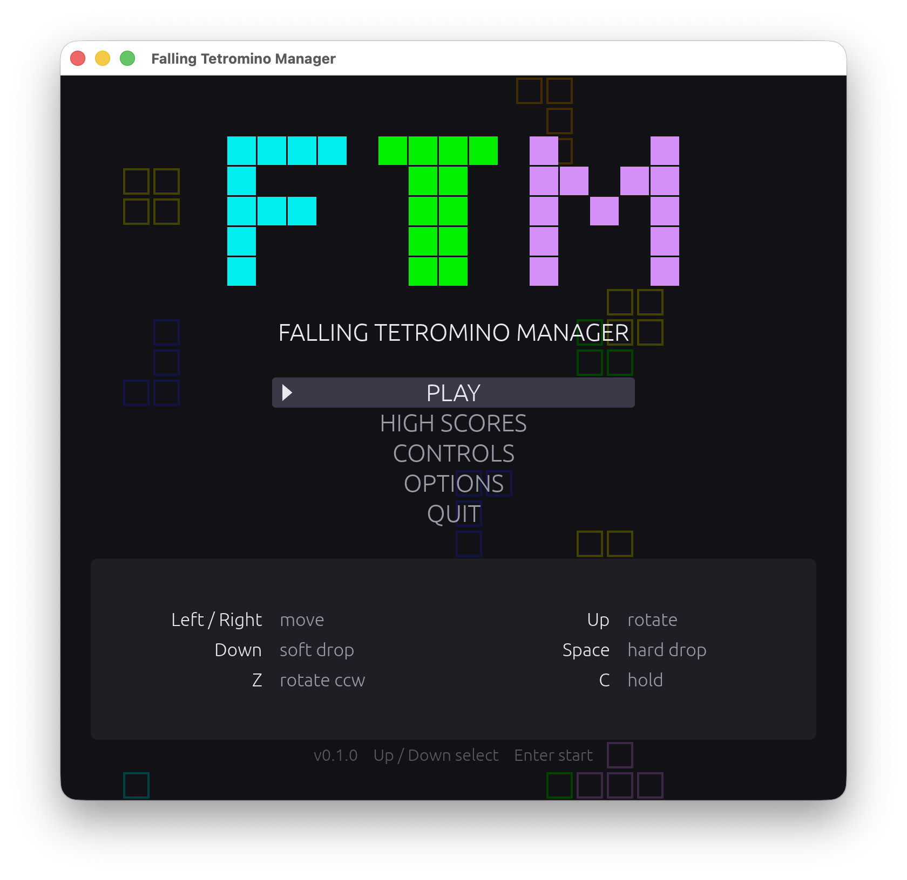
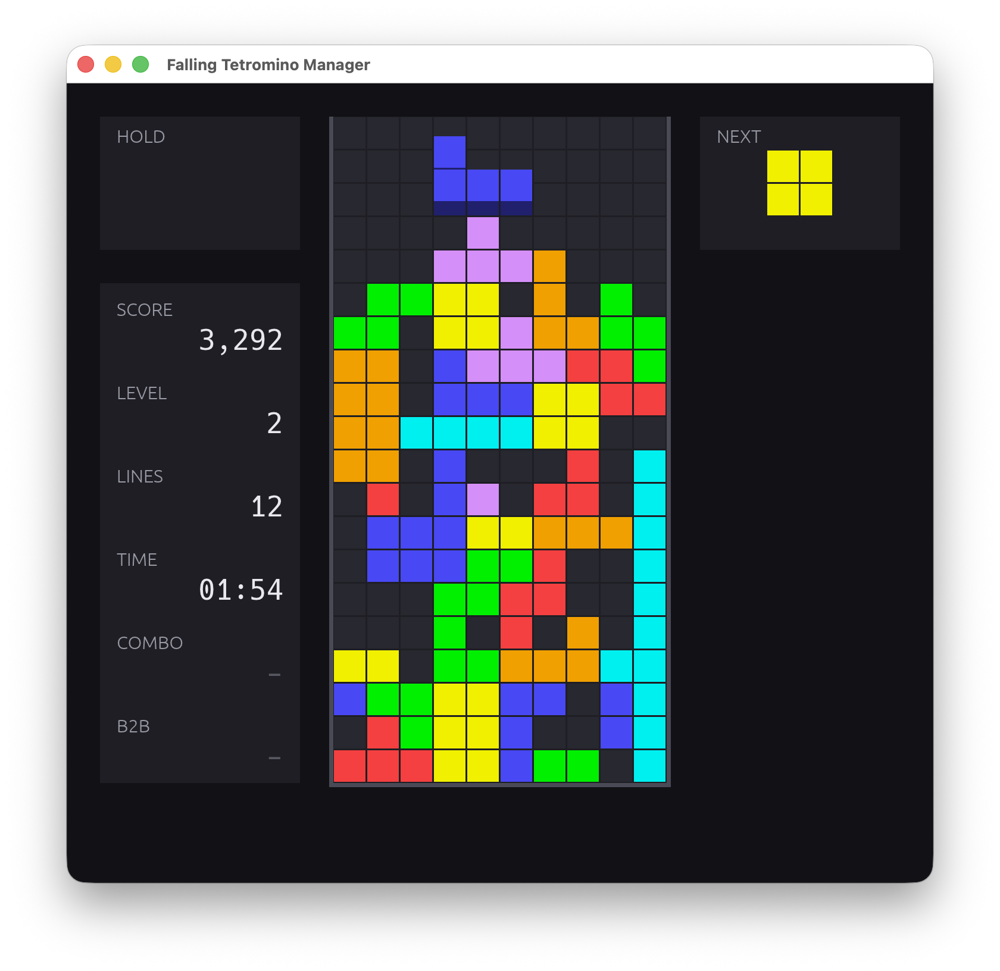

# Falling Tetromino Manager

> Falling Tetromino Manager (FTM) is a best-in-class, terminal-native solution
> for the end-to-end lifecycle management of descending tetromino assets.
> Leveraging a lightweight TUI architecture, FTM empowers users to orchestrate
> real-time rotation, translation, and vertical descent workflows at scale,
> while its proprietary line-clearing engine drives measurable efficiencies in
> row consolidation and playfield optimization. With zero-dependency deployment,
> low-latency input handling, and full compliance with industry-standard
> gameplay guidelines, FTM enables stakeholders to maximize stack density,
> minimize topological debt, and unlock actionable insights across the entire
> block-placement value chain. Whether you're a single-terminal operator or an
> enterprise seeking to modernize your legacy falling-block infrastructure, FTM
> delivers the synergy, scalability, and vertical alignment your organization
> demands— because when it comes to mission-critical tetromino operations,
> failure to plan is the same as planning to top out.

---

More seriously, FTM is a guideline-conformant falling-block game for the
terminal: a single Rust binary with no server, no `unsafe`, and a pure rules
core that knows nothing about the terminal it is drawn on. Pieces fall on a
fixed 60 Hz tick, so the same seed and the same inputs always produce the same
game.

<table>
  <tr>
    <td align="center">
      <br>
      <sub><b>FTM console attract screen</b></sub>
    </td>
    <td align="center">
      <br>
      <sub><b>FTM console game mode</b></sub>
    </td>
  </tr>
  <tr>
    <td align="center">
      <br>
      <sub><b>FTM egui attract screen</b></sub>
    </td>
    <td align="center">
      <br>
      <sub><b>FTM egui game mode</b></sub>
    </td>
  </tr>
</table>

```
make run                     # play it (console)
make run-gui                 # play it (egui)
cargo run -- --help          # the options (console)
cargo run -- --print-config  # the effective configuration (console)
```

Settings live in `config.toml` under the platform config directory
(`~/Library/Application Support/ftm/` on macOS, `~/.config/ftm/` on
Linux); a fully-commented copy is written there the first time the game exits
cleanly, and the in-game Options panel — pause, then **Options** — edits the
settings most worth changing without a text editor.

The specification is [FTM.md](FTM.md) and it is ground truth: if the code and
the spec disagree, the spec is wrong until it is amended. It has three
companion documents, and section numbers are stable across all four — a
section that moved kept its number: [FRONTEND.md](FRONTEND.md) is the contract
any front-end is written against, [TUI.md](TUI.md) specifies this terminal
front-end (§8, §12.1–§12.6, §13), and [GUI.md](GUI.md) is reserved for an egui
front-end in a window and in a browser.

[PLAN.md](PLAN.md) sequences the implementation into twelve stages; all twelve
are complete. [EGUI.md](EGUI.md) is the live plan, and adds the second and
third front-ends.

Requires Rust 1.88 or later (edition 2024 needs only 1.85; `ratatui` sets the
floor). `make check` runs everything CI runs: `cargo fmt --check`, `cargo
clippy -- -D warnings`, `cargo test`, the two boundary checks and a release
build. The second boundary check builds the rules and the shell for
`wasm32-unknown-unknown` — they use no clock, no filesystem, no entropy and no
calendar of their own — so it wants `rustup target add wasm32-unknown-unknown`.
