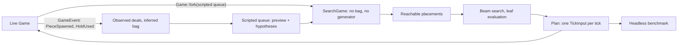

# PILOT implementation plan

An automated player: a mode the player selects from §13.3's menu, which plays
the game itself through the ordinary rules while they watch.

## The name, and the numbers

- The mode is **PILOT**, not ROBOTO. Roboto is Google's typeface, and §1.3
  keeps a trademarked word out of the game entirely rather than beside it —
  the decision that made a four-line clear a `QUAD`. The word appears in
  `spec/PILOT.md`, `src/pilot/`, `src/bin/ftm-pilot.rs` and one menu row, and
  nothing in the tree is renamed for it.
- **`PILOT.md` owns §P1-§P9** and this plan's stages are **P0-P8**. The letter
  is shared deliberately: `GUI.md` owns §G1-§G9 while `EGUI-PLAN.md` has stages
  G0-G13, and the `§` is what tells them apart — "§P4 by P6" reads the same way
  "§G5 by G8" already does. Do not invent a second letter for the stages.
- **Nothing is renumbered.** `PILOT.md` is a fifth document, `FTM.md` §1-§19 do
  not move, and the sections this plan amends keep their numbers. CLAUDE.md's
  four-documents table becomes five in stage P1, in the same commit as the
  first §P number that anything cites.
- `PILOT.md` is normative since P1, and source comments cite `PILOT.md §Pn`
  the way they cite `GUI.md §Gn`.

## Scope and decisions

- G13 is complete and milestone MG7 is accepted. PILOT starts from that
  accepted baseline and changes nothing about it that is not listed here.
- **This is a deliberate amendment to a standing scope rule.** CLAUDE.md says
  "§18 remains out of scope", and §18's first bullet is this feature, filed as
  deferred: *"A self-playing demo driven by a simple heuristic bot is the most
  likely addition; it would need a placement search and would reuse `Game`
  unchanged."* This plan promotes that one bullet and no other. Sound, replays,
  extra modes, per-piece statistics and colour themes stay deferred, and §19
  stays a list of constraints.
- **§18's bullet is amended rather than contradicted.** It imagines the bot as
  the *attract screen's* idle demo; this plan makes it a menu item the player
  chooses, and excludes the idle demo. §18 is rewritten in P1 to say so, so it
  no longer describes something nobody is building.
- §1.1 gains the mode in its feature list, and §1.2 — "the game is
  keyboard-driven" — gains a sentence: PILOT is the one mode where nobody is at
  the keyboard, and the keys that remain live while it plays are the spectator's
  (§7's pause, §10.1's restart and quit), not the game's.
- The first release includes the selectable menu item on the terminal and the
  native window, and a native headless benchmark. It excludes the idle attract
  demo, automated weight training, pointer or touch control, and any path from
  an automated run to §14's table.
- **There is no browser PILOT.** A tab's search would run on the frame thread
  and no requirement asks for it, so the browser's menu does not offer the mode
  (see *Portability* below, which is not the same decision).
- The planner is **fair**: it decides from locked visible cells, the current and
  held pieces, the configured preview queue, and a 7-bag remainder inferred only
  from pieces already observed. This is enforced by a type, not by a convention
  or a test (see *Information and fairness*).
- The planner is **deterministic and takes no clock**: integer weights, canonical
  action ordering, a fixed beam and an integer node budget. It never consults
  elapsed wall time, a frame counter, or anything a front-end knows.

## The decisions this plan rests on

1. **Reuse `Game`, do not write a second simulator.** §18 said so and it is
   right: a private board model would drift from §9's rules — kicks, lock down,
   §9.13's T-spin flag, §9.12's ordering — and the drift would show as a bot
   that plays legally in search and illegally in the game.
2. **Fairness is structural.** A cloned `Game` carries the real generator and
   the real bag; `Game::bag_remaining` (`core/game.rs:337`) is hidden
   information with a public-in-crate accessor. A searcher that holds a `Game`
   is one autocomplete away from cheating silently, and no test would notice
   until someone read the diff. So the searcher never holds a `Game`.
3. **The planner is a pure function of the fair state.** That is what makes
   `tests/pump.rs`'s cadence invariance hold for an automated round, and
   cadence invariance is what proves the mode did not quietly become a
   real-time system.
4. **Something plays early.** G5 hung an empty application on the pump before
   any of it drew a game, and that is why G6-G13 were short. The equivalent
   here is a bot that plays badly on both front-ends at stage P4, before beam
   search, chance nodes or tick-exact reachability exist.
5. **The benchmark comes before the clever search**, because every stage after
   it is an optimisation, and an optimisation without a baseline is a rewrite.

## Architecture



- Add a platform-free top-level `src/pilot/` module with a small public API:
  `Pilot` (the controller), `Settings`, the benchmark's report types, and — as
  P2 found — the three things a caller outside the crate has to be able to
  name: §P2.4's `Knowledge`, §P2.3's `Fork` and §P5's features and weights. It
  is a sibling of `core/` and `shell/`, not a part of either.
- `src/pilot/` may name the core's façade (`core/mod.rs`'s re-exports) and the
  one crate-private search seam below, and nothing else inside `core`. It may
  name `shell::config::RulesConfig`, and nothing else in the shell: the planner
  must not learn what a screen, a key or a stamp is.
- Add the seam as a new `pub(crate) mod search` in `core`, re-exported from
  `core/mod.rs` with `pub(crate) use` — **not** `pub use`. §17.3's A10 is
  therefore unchanged: the core's *public* surface does not grow, and a §19
  client is handed exactly what it was before.

## Information and fairness

The seam is one constructor and one restricted type:

```rust
// core/search.rs, pub(crate)
impl Game {
    /// A fork for search: the same rules and the same board, with the bag
    /// replaced by exactly the pieces the caller supplies.
    pub(crate) fn fork(&self, queue: &[PieceKind]) -> SearchGame;
}
```

- `SearchGame` wraps a `Game` whose randomiser has been **replaced**, not
  merely hidden: it holds a scripted queue and no generator, so there is no
  hidden future inside it to read. When the scripted queue is exhausted it
  refuses to spawn and reports `Exhausted`; the search stops at its own
  horizon because the fork cannot go past it.
- `SearchGame` exposes `tick`, `state`, the board, the current and held pieces
  and the scripted queue's remainder. It does not expose `bag_remaining`,
  `preview` or the inner `Game`. `Game::fork` is the only constructor.
- The caller builds the scripted queue from fair information only: the visible
  preview (exactly `preview_count`, which is what `GameView` shows) followed by
  hypotheses drawn from the inferred bag remainder. Hypotheses are the caller's
  own, so a test that changes the live game's hidden future cannot change a
  plan — and neither can a future maintainer, without deleting a type.
- **Observation is exact and needs no diffing.** `GameEvent::PieceSpawned(kind)`
  (`core/events.rs:135`) names every piece as it is dealt and `HoldUsed` is a
  separate event, so the bag tracker counts deals rather than reconstructing
  them from a changing preview. Seven deals close a bag; the remainder is the
  set not yet seen in the open one.
- A hold swap is not a deal. A swap with an empty hold slot *is* followed by a
  deal, and the event stream says which happened.

## When the planner thinks

This is a rule, not an implementation note, and it is what the mode's
determinism rests on.

- The planner runs **inside the tick that spawns a piece**: the tick whose
  events contain `PieceSpawned` (and nothing else re-plans — a hold in the plan
  is part of the plan). It produces a **plan**: one `TickInput` per tick, from
  the next tick until the piece locks.
- Every following tick pops one input from the plan. A plan is never recomputed
  from a partially executed state, so the live game replays exactly what the
  search simulated.
- **The planner is never amortised across frames and never bounded by wall
  time.** A front-end may pump at 60 Hz, at 144 Hz, twice in a millisecond or
  once after a minute; the plan is the same because it is a function of the
  game's state and the settings alone. Spreading a search over frames would
  make the round cadence-dependent and would break the acceptance check this
  plan sets itself.
- **`App::advance` changes shape.** Today a batch of ticks gives its edge
  actions to the first tick only and `Actions::default()` to the rest
  (`shell/round.rs:602-640`), because a human produces input per frame. A
  planned round needs the batch's *n*th input on the batch's *n*th tick. The
  human path must stay byte-identical — the terminal's mock-ups and
  `tests/pump.rs` say so — so this is a branch inside `advance`, not a
  rewrite of it.
- A batch may be up to `MAX_CATCH_UP_TICKS` ticks after a stall, and may
  therefore contain more than one spawn. The node budget is sized so that a
  full catch-up batch of searches still fits in a frame; this is measured in
  P5, not assumed.
- **Input honesty.** A `TickInput` may legally shift ten cells at once
  (`shift_cells: u8`) and carry four actions. PILOT is capped at **one action
  and at most one shift cell per tick** — still 60 cells a second, but a piece
  that travels rather than teleports, which is what §12.5's hard-drop trail and
  lock flash are drawn for. The cap is normative in §P3 and is a test.

## Search and evaluation

- Score immediate outcomes from the core's own events and score deltas. Apply
  the full board evaluation **only at leaves**, so a persistent defect is not
  charged once per ply.
- Integer weights and integer features throughout, in the house style of §9.9's
  16.16 gravity: no floating point anywhere in the planner, so a plan is
  identical on every target and in every build profile.
- Begin with completed clears, holes, covered-hole depth, aggregate and maximum
  height, bumpiness, row and column transitions, blockades, wells, top-out,
  combo and back-to-back state, and perfect clears. Keep feature extraction and
  weights independent structures; weights are hand-tuned at first and automated
  tuning is not in this plan.
- **Depth is clamped by `preview_count`**, which §6.3 allows to be 1. At
  `preview_count = 1` the search reaches a chance node at the second ply, so the
  expected/worst-case blend is load-bearing in an ordinary configuration rather
  than an edge case. Two plies is the default; a deeper setting costs nodes and
  is the benchmark's business.
- Beyond the visible horizon, branch uniformly over the inferred bag remainder
  and combine expected and worst-case values at an integer 80/20 ratio. The
  hypotheses are the caller's; the fork has no others to offer.
- Deduplicate intermediate states by pose, lock state, rotation metadata, hold
  state and queue position; deduplicate terminal outcomes by board, hold and
  queue. Cache subtrees by board, current and held piece, scripted queue,
  inferred remainder and remaining depth.
- Resolve equal evaluations by lower top-out risk, then fewer inputs, then
  canonical action order, so every machine chooses the same move.
- **The node budget is an integer count, and exhausting it returns the best
  fully evaluated move.** A partially evaluated branch is never chosen: that is
  what keeps the answer independent of where the count happened to run out.

### Cost, which is a design constraint rather than an optimisation

- A fork copies a 400-byte matrix and allocates; `GameEvent::LinesCleared`
  allocates a `Vec` per clear. At one search per piece this is nothing; at
  benchmark rates it is the whole cost. Reuse one event buffer in the searcher,
  exactly as `App` does (`shell/round.rs:283`), and pool forks if the benchmark
  says it matters.
- **Replay verification is a debug-mode check, not a production cost.** "Replay
  the chosen sequence against an untouched fork and compare" doubles the work
  for a property that is either a bug or nothing, so it is `debug_assert`-shaped
  and always on in tests and in the benchmark's debug build. The live round gets
  it for free anyway: a plan that diverges from its prediction is caught by the
  same assertion as it is consumed.

## Portability

- `src/pilot/` is **platform-free and compiles on every target**: no `Instant`,
  no `std::fs`, no `rand::random`, no calendar, and no `cfg(target_arch)`. It
  joins `make shell` and `make portable` in P2, and those two are the compiler
  holding the "no clock" rule that the cadence acceptance check depends on.
- That is not the same decision as offering the mode in a browser. The module
  compiles for wasm32; the tab's menu does not list PILOT, because
  `Session::menu` is a runtime list and "a screen offers what its front-end can
  do" is already how this is said. No `cfg` is involved, and no code is dead:
  the enum variant exists everywhere and one list omits it.
- `src/bin/ftm-pilot.rs` is native-only, gated like `src/native.rs` — a
  benchmark needs an argv and a clock. `default-run = "ftm"` is unchanged, and
  `cargo check --no-default-features`, `make portable` and `make web-check`
  must all stay green.

## Shell and front-end integration

- **`MenuChoice` gains `Pilot`**, sitting under `Play`. `MenuChoice::ALL`
  becomes six items — the terminal's and the native window's — and the tab's
  list stays at four. Rename `MenuChoice::NO_QUIT` to **`MenuChoice::CANVAS`**
  in the same commit: it is no longer "the same list without quit", it is the
  browser's list, exactly as `Setting::CANVAS` is the browser's panel.
- **`Next` carries the player.** `Next::Play` becomes `Next::Play(Player)` with
  `Player::{Human, Pilot}` (§7, settled in P1), so the attract screen's choice
  is what `Round::new` reads and a restart carries rather than rediscovers.
- `App` gains the controller beside the input state, and `play_key` drops
  gameplay bindings while it is present. Pause, the pause menu, §10.1's restart
  hold, the Options panel, the controls box and quit all stay live: a spectator
  can stop, look and leave.
- **The pause menu's Restart keeps the mode.** A `Phase` that carries it is the
  simplest way; a restart out of a PILOT game must not silently hand the player
  a game they are not holding the keyboard for.
- **Losing the keyboard still pauses**, as `GUI.md` §G4.7 has it. The player
  was not typing, but the rule is the same rule, a paused game blanks the stack
  under §9.17 either way, and it stops a backgrounded window spending a search
  budget per frame. Written into §P6 rather than inherited by accident.
- **No automated run reaches §14's table.** The suppression goes beside the
  seeded-run rule in `App::finish` (`shell/round.rs:528`), which is already the
  one place that knows a run's provenance, and `Session::recent` must stay
  `None` so the attract screen highlights nothing.
- **What ends an interactive PILOT game** is the spectator, a top out, or
  nothing: a good planner may not top out for hours. §P6 states it plainly and
  there is no piece cap on the interactive mode; the benchmark has one.
- An unambiguous indicator on both playing screens (`tui/playfield.rs`,
  `gui/playfield.rs`) so a screenshot of a PILOT game can never be mistaken for
  a player's.
- **Layout, measured before it is promised.** The terminal's attract block is
  21 rows against §12.1's 24-row minimum (`tui/attract.rs:57`), so a sixth menu
  row fits with two to spare. The window reserves a five-row band
  (`gui/attract.rs:48-64`) and its footer sits on row 22 of §G3's 24-row grid:
  a sixth row puts the footer on the last row. Check that before committing to
  the row; the alternative is one fewer blank row above the panel. §12.1's and
  §G3.3's minimums do not move either way.
- Update the exact terminal mock-up tests and the GUI layout and render
  fixtures rather than weakening them.

## Headless benchmark

- `src/bin/ftm-pilot.rs`: no render, native, over the same controller the
  interactive mode uses. Behind a `bench` feature rather than a front-end's,
  and split in two at §P3.3's line — `pilot::bench` plays and counts, with no
  clock, and `src/bench.rs` holds the grammar and the wall clock.
- Arguments: a seed range or count, a piece cap, depth, beam width, node budget,
  and text or JSON output.
- **It pins the rules itself and never reads §6.2's config file.**
  `preview_count` alone changes how well the bot plays, so a baseline that
  depended on whoever ran it would compare nothing. It takes `--preview`,
  `--start-level`, `--hold`, `--rot180` and `--lock-down` with the spec's
  defaults, and prints the resolved `RulesConfig` in the report header.
- Reports score, lines, pieces, top-out rate, nodes searched and placements per
  second. Wall-clock throughput is reported; **acceptance limits use node
  counts**, which are deterministic.
- Checked-in fixed seed sets for comparing evaluator and search changes.
- **Plan snapshots live in their own file and are expected to churn.** A weight
  change moves them by design, which is the opposite of what
  `tests/snapshots/scripted_game.txt` is for. The I1 snapshot and §19.4's
  batch-invariance canary must not move at any stage of this plan, and a stage
  that moves one has found a bug.

## Delivery stages

### P0 — Accepted baseline

Complete. `EGUI-PLAN.md` G13 and B1-B12 are signed off; the two front ends,
`tests/pump.rs`, `tests/gui_render.rs` and the mock-up tests are the fixed
baseline.

### P1 — Specification and contracts ✅

Done, and docs only: no code was written, and `src/` is byte-identical.

- `PILOT.md` is normative, §P1-§P9, with §P9's C1-C13 table.
- `FTM.md` §1.1, §1.2, §4, §7, §14, §15.4 and §18 amended; `TUI.md` §13.3 and
  §12.4, `GUI.md` §G4.5, §G4.7, §G7.4, §G7.5 and §G8.1 amended; CLAUDE.md's
  document table, scope rule and invariants. Nothing renumbered.
- `pilot::Pilot`/`Settings` (§P3.4) and the `Game::fork`/`SearchGame` seam
  (§P2.3) are written down as signatures.

**What it settled.**

- **`Next::Play(Player)`**, with `Player::{Human, Pilot}` — the payload rather
  than a fourth `Next` variant, because every front-end already matches `Next`
  exhaustively and a restart has to *carry* the player rather than rediscover
  it. §7's table gained one row and its diagram none.
- **The indicator is `PILOT`, left-aligned on the status row**, for the whole
  game rather than transiently, in both front-ends. The centred status content
  is the longest thing that could collide with it and does not: `PERFECT CLEAR`
  is 13 characters and centres well clear of column 5.
- **The two layouts were measured on the running binaries, not reasoned about,
  and they disagreed.** The terminal's attract block must grow from 21 rows to
  22: with six menu items the footer line falls out of the block *silently*, by
  clipping, which is exactly what a spec written from arithmetic would have
  promised away. The window needs no change at all — §G7's menu band is five
  rows reserved whatever the menu's length, so six items centre into the blank
  rows either side and neither the panel nor the footer moves. Both are in
  `PILOT.md` §P7.2, and the screenshot is what settled the second.
- **`MenuChoice::NO_QUIT` becomes `CANVAS`** in P4, for the reason in §P7.1.

### P2 — Knowledge, evaluation, and the fork ✅

- `Game::fork` and `SearchGame`, with the exhaustion behaviour and a test that
  a fork has no reachable hidden future.
- Bag observation from `PieceSpawned`/`HoldUsed`; bag-boundary and remainder
  inference, unit-tested against hold swaps and short previews.
- Board features and the integer evaluator, unit-tested one feature at a time.
- `src/pilot/` joins `make shell` and `make portable`.

**What it settled.**

- **The randomiser is replaced one level lower than expected.** `core/bag.rs`
  now holds a `Source` of two kinds — §9.6's generator with the bag it
  shuffles, or a scripted list — rather than a `Game` that keeps its bag and
  agrees not to ask it. `Bag::next_piece` returns `Option`, and the `None` is
  reachable only from a fork. §17.2's I1 snapshot and §19.4's canary did not
  move, which is the assertion rather than a convenience.
- **An exhausted fork waits in the entry delay.** It is not over and has not
  topped out, so a search can tell "I have run out of knowledge" from "the game
  ended", which is a distinction P6's leaf evaluation depends on. §P2.3 says so
  now.
- **A stage that lands a seam lands only the part of it that is read**, because
  `#![allow(dead_code)]` is gone and the tree means it. §P2.3's method list is
  an upper bound rather than a shopping list, and is amended to say so: P2 has
  `tick`, `state`, `view`, `scripted` and `exhausted`, and the pose and hold
  state arrive with P3's generator.
- **`pilot::Fork` exists because a crate-private type cannot appear in a public
  signature.** That is structural and permanent, not a lint workaround: §P2.3
  requires `SearchGame` to stay out of the core's façade, so `tests/` and §P8's
  runner search through `pilot`'s own wrapper. It is also where the *queue*
  arrives, which is the half of fairness a type cannot hold.
- **The first piece is the deal no event mentions**, and the bag closes on the
  seventh rather than the eighth. Both are in §P2.4 now; both were bugs first.
- **A preview can cross a bag boundary**, so a piece on the screen may also be
  a legitimate hypothesis — which is not an edge case at the default preview of
  5, and cost a test assertion that was simply wrong about §9.6.
- The evaluator's starting weights are provisional and say so. Two judgements
  they already have to get right are tested: a clean stack beats the same stack
  with a hole in it, and no board is worth a top out.

### P3 — Placements, one ply ✅

- Hard-drop placement generation: rotate at spawn, shift, drop — the simple
  generator `PILOT.md` recommends starting from, honouring the one-action,
  one-cell-per-tick cap.
- One-ply choice with canonical ordering and the tie-breakers.
- Plan replay verification as a debug assertion.

**What it settled.**

- **A placement is played, not predicted.** Every candidate is replayed through
  the real rules on a fork and measured from the board it leaves behind, so
  there is no arithmetic anywhere about where a piece lands. That is what makes
  a rotation that kicks at a high stack, a shift that runs into a wall and a
  piece that gravity locks early all ordinary rather than special cases — and
  it is why `SearchGame` gained nothing this stage. §P2.3 expected the pose and
  the hold state here; a generator that replays reads the position from
  `view()` and wants neither. Both sections are amended.
- **The plan is truncated at the tick that locks the piece**, whichever tick
  that is. An input after the lock is one the *next* piece receives, which is
  the divergence §P3.1 forbids rather than a plan. The fork is what knows.
- **The divergence assertion found the one thing it could not compare, on its
  first run.** A hold at a `preview_count` of 1 uses the fork's queue up, so the
  tick that locks the piece cannot say what spawns after it — the live game
  deals a piece that was hidden when the plan was made. The prediction carries
  whether the fork still knew, and the comparison stops exactly there: the
  board, the figures and the hold slot always, the next piece only when it was
  not past the horizon. The assertion is worth its keep already.
- **It does not play badly.** P4 says to expect that, and it was wrong: one ply
  over §P5's starting weights plays **20,000 pieces on each of five seeds
  without a top out**, ~8,000 lines and level 800 each. So the lookahead of P6
  has a harder baseline to beat than the plan assumed, and P5's benchmark is
  what will say whether it beats it at all.
- **The cost, measured, and it is P5's starting figure.** ~104 candidates per
  piece — two hold choices × four orientations × thirteen columns — at about
  155 µs a piece in release, or **~6,500 pieces a second** on this machine.
  (Written here as "placements a second" and corrected in P5, which measured the
  same thing with an instrument: 6,500 is the reciprocal of 155 µs and so counts
  *pieces*, and the placement rate is 104 times it.) A frame is 16 ms, so a full
  `MAX_CATCH_UP_TICKS` batch is nowhere near it even at one search per tick; the
  number to check in P5 is the one after P6's second ply, not this one.
- **`Settings` is landed unread.** `Pilot::new`'s signature is §P3.4's, and a
  settings-shaped argument that arrives two stages later is a signature that
  changes under its callers. `settings()` is what reads the field — §P8's
  report header is who will want it.

### P4 — It plays ✅

- `MenuChoice::Pilot`, the `CANVAS` rename, `Next` carrying the mode, the
  controller inside `App`, the per-tick input path in `advance`, spectator
  controls, no high scores, the indicator on both playing screens.
- Terminal mock-ups and GUI render fixtures updated.
- At the end of this stage a person watches it play on both front ends. It is
  expected to play badly.

**What it settled.**

- **It was watched on both front ends, and it does not play badly.** P3 already
  said so headlessly; this is the same finding with a screen in front of it.
  The terminal at seed 42 had **14 lines and level 2 within six seconds** of the
  menu, and the window the same, and neither looked like a machine flailing —
  the pieces travel rather than teleport, which is §P3.2's cap being a
  presentation decision as much as an honesty one. The sentence above is left
  as it was written: what P4 expected is part of what P4 found out.
- **The planner's branch is four lines inside `advance`, and the human path is
  byte-identical.** The batch is where the two differ (§P3.1) — the same six
  ticks as one batch and as six give the same board, which is the cadence
  invariance of §P9's C4 reached from the inside, and `tests/pump.rs` now runs a
  whole PILOT round at 60 Hz, 144 Hz and a jittery cadence to say it from the
  outside. `observe` is handed the slice of the shared event buffer that tick
  appended, because the buffer belongs to the frame and §12.5 absorbs all of it.
- **Two amendments the stage was not expecting, and both were the spec's.**
  §13.3's panel cycle pauses on any item but the two that *start a game*, so
  PILOT had to join PLAY — and the index that answers it is a front-end's list's
  (`MenuChoice::CANVAS` has no PILOT at all), so `Attract` remembers the item the
  cursor is on rather than only where it is. And §12.4 and §G4.5 both say the
  indicator is drawn in the `I`-piece cyan, which the first implementation was
  not; it is now, in both front-ends, and the colour is asserted in both.
- **The spectator's keys are dropped at the input boundary, not downstream.**
  §P7.3 says the gameplay keys do nothing, and the cheap way to read that is
  "ignore what they produce". That would have left a held direction charging DAS
  and a press resetting a lock-delay timer behind a game nobody is playing — the
  reason §10.1 drops a disabled mechanic's key where it does. Pause, the pause
  menu and everything reachable from it, §10.1's restart hold, quit and Ctrl-C
  are what stay live.
- **`Next::Play(Player)` cost less than the menu did.** Every front-end already
  matched `Next` exhaustively, so the payload was a compiler-guided edit; the
  sixth menu item is what reached into `tui::attract`'s block height, the two
  render fixtures and three of the shell's own tests. §P7.2's measurement was
  right on both counts — the terminal's block went 21 → 22 rows and the window
  needed nothing — and the assertion that would have caught the silent clipping
  was already there: the footer line is the last row of the block, and
  `the_screen_holds_the_wordmark_the_menu_and_the_panel` looks for it.
- **The window is still awkward to drive, and the awkwardness is focus.** Three
  of five scripted runs sent their keys to whatever was in front instead —
  `osascript` reports success either way, exactly as `EGUI-PLAN.md` G13 recorded.
  What works is one shell invocation that launches the binary, waits, sends the
  keys and screenshots, with nothing in between to steal the foreground.

### P5 — Headless benchmark ✅

- The runner, the stable text and JSON reports, argument and schema tests, a
  small deterministic smoke batch for `cargo test`, and a documented
  release-mode baseline command with its recorded result.
- Measure the per-piece search cost, including a full `MAX_CATCH_UP_TICKS`
  batch, and record the node budget that fits a frame.

**What it settled.**

- **The recorded baseline, and the command that produces it.** `make bench` —
  `cargo run --release --features bench --bin ftm-pilot -- --seeds 8
  --pieces 2000` — on the machine P3 was measured on:

  | | |
  |---|---|
  | 8 seeds × 2,000 pieces | 16,000 pieces, 6,381 lines, **no top out** |
  | mean per game | 4,083,485 score, 797 lines, level 80 at the cap |
  | cost | 1,664,000 nodes, 2.33 s, **145 µs a piece**, ~715,000 nodes/s |

  And the longer run P3 claimed headlessly, now an instrument reading:
  `--seeds 5 --pieces 20000` is 100,000 pieces, 39,989 lines and **no top out**
  in 14.2 s, at 141 µs a piece. One ply over §P5's starting weights is a real
  baseline, not a placeholder, and P6 has to beat it rather than replace it.
- **The node budget, which is the open decision this stage was to answer:
  ~1,900-2,000 nodes per search.** A frame at §15.1's tick affords ~11,900
  nodes at the measured rate, and §15.2 step 4 may play `MAX_CATCH_UP_TICKS`
  ticks before it draws, so the worst case is six searches inside one frame and
  the budget is that figure divided by six. `Settings::default().nodes` is
  100,000 and is therefore **fifty times over**, which is harmless while P5's
  search has no budget to run out of and is P6's first correction. Two things
  make the number conservative on purpose: it is derived from the *mean*
  per-piece cost, and six spawns in six consecutive ticks cannot actually happen
  — §9.12's two delays see to that — so the real worst case is kinder than the
  one budgeted for.
- **The benchmark is split at §P3.3's line, and that is the design decision of
  the stage.** `pilot::bench` plays the games and folds them into integers with
  no clock in it — `make portable` compiles it for a target that has none — and
  `src/bench.rs` holds §P8.1's grammar and the wall clock, beside `src/argv.rs`
  and behind a `bench` feature of its own. The consequence is the report's
  shape: the rows are integers and reproduce byte for byte, the throughput is a
  trailing block headed as this machine's, and §P8.2 is amended to say so. A
  runner that had timed the games from inside `pilot/` would have put a clock in
  the one directory the whole plan says may not have one.
- **`--seeds` resolves to a list, whichever way it is spelled**, because a
  checked-in set need not be contiguous and a report should say what it played.
  The `A..=B` spelling was added for the reason a URL took five spellings of
  "on" in G12: the thing is typed by a human who knows what `..` means in Rust
  and will be surprised either way, so accept both.
- **P3's cost figure was mislabelled, and measuring it is what found that.**
  "~6,500 placements a second" is the reciprocal of 155 µs and therefore counts
  *pieces*; the placement rate is 104 times larger. P3 is corrected above. The
  general lesson is the stage's: a figure derived by arithmetic in a commit
  message is not the same artefact as one an instrument printed, which is why
  §P8.2 asks for both counters by name.
- **The two counters exist now, and they are equal.** `Counted { nodes,
  placements }` is on `Pilot` and is the only thing it accumulates that is not a
  decision. They move together at one ply; P6 is where they part. Nothing in the
  planner reads either back, because a counter a search consulted would be
  §P3.3's clock wearing a different hat.
- **§4's tree had drifted since P2 and is corrected in the same commit.** It
  named `placements.rs`, `evaluate.rs` and a `mod.rs` holding `Pilot`, none of
  which were ever written; the code is `placement.rs`, `eval.rs`,
  `controller.rs` and `fork.rs`. The spec is ground truth and was wrong, which
  is the case the rule is written for.

### P6 — Lookahead ✅

- Leaf evaluation, two-ply search, beam pruning, the transposition cache,
  chance nodes over the inferred remainder, and the 80/20 blend.
- The node budget and the best-fully-evaluated-move rule.
- Fixed-seed plan snapshots, and the hidden-future isolation test.
- Report the improvement against P5's baseline, in the commit message.

**What it settled.**

- **The improvement is real, small, and smaller than the stage expected — because
  P5's baseline was already at the ceiling.** A piece is four cells and a row is
  ten, so 0.4 lines a piece is arithmetic and not a target. One ply was already
  scoring 0.39881 of it at 8 × 2,000 and **0.39990 at 8 × 20,000**. There was
  nowhere for a second ply to go:

  | 8 seeds × 2,000 | lines | score | top out | µs/piece |
  |---|---|---|---|---|
  | one ply (P5) | 6,381 | 32,667,884 | 0 | 142 |
  | two plies | **6,388** | **33,479,132** | 0 | 2,510 |
  | one ply, `--preview 1` | 6,381 | 32,667,884 | 0 | 141 |
  | two plies, `--preview 1` | **6,387** | 32,770,214 | 0 | 2,771 |
  | one ply, `--no-hold` | 6,378 | 33,388,778 | 0 | 70 |
  | two plies, `--no-hold` | **6,383** | 32,562,890 | 0 | 1,163 |
  | one ply, `--preview 1 --no-hold` | 6,378 | 33,388,778 | 0 | 69 |
  | two plies, `--preview 1 --no-hold` | **6,385** | 32,316,702 | 0 | 2,397 |

  And the long run, which is where the ceiling is plainest — 160,000 pieces is a
  theoretical 64,000 lines:

  | 8 seeds × 20,000 | lines | of a possible | score | top out | µs/piece |
  |---|---|---|---|---|---|
  | one ply | 63,984 | 64,000 | 3,246,007,704 | 0 | 151 |
  | two plies | **63,988** | 64,000 | **3,268,570,144** | 0 | 2,546 |

  Four lines in a hundred and sixty thousand pieces. That is not a
  disappointment in the search; it is the measurement telling you there was
  0.025% of the axis left.

  **Lines went up in all five configurations** — +7, +6, +5, +7, +4 — which is the
  one metric here that is monotone in playing well. Score went up in one and down
  in three, and that is not a quality signal: nothing in §P5's weights prefers a
  quad to four singles, so the score is a by-product of which clear kinds the mix
  happened to use. The cost is 8× to 18× the nodes.
- **`--preview 1` stopped being free, which is how you can tell §P6.3 is
  running.** At one ply the preview made no difference at all — the queue only
  decides which piece a hold-into-an-empty-slot plays, and that one is visible —
  so P5's `--preview 1` row is byte-identical to its default row. At two plies it
  is not: the second ply is a chance node, seven roots are searched and blended,
  and the figures move. A row that is suspiciously identical to another row is
  worth looking at twice; this one was telling the truth both times.
- **What lookahead did *not* buy is robustness, because there is none to buy.**
  Zero top-outs at either depth, in every configuration, at 2,000 pieces and at
  20,000 — 320,000 planned pieces across the two long runs without one.
  The axis where a second ply should shine — surviving a stack one ply
  would have buried itself under — cannot be measured against a baseline that
  never dies. This is the honest answer to P7's open question as well: the
  benchmark as specified has no headroom left to show, and a placement a hard
  drop cannot reach will have to be justified by the placements themselves rather
  than by a number going up.
- **The three settings are one decision, and it is the budget's.** `nodes` is
  2,000 now rather than 100,000, which was P5's stated first correction. Two plies
  over a beam of sixteen costs 104 candidates plus sixteen expansions of about the
  same — 1,784 measured, against the 2,000 a search may spend if six of them land
  in one `MAX_CATCH_UP_TICKS` frame. Beam 16 is therefore not a taste: 32 would be
  cut off by the budget halfway through, and §P6.4's answer would quietly become a
  shallower one than `depth: 2` asked for. §P6.4 is amended to say so.
- **The budget's granularity is a ply, and that had to be written down.** A
  search is stopped between one ply and the next, never inside a generation, so it
  may overrun by the placements of the ply it was in — 104 of them. The
  alternative is comparing half a generation against a whole one, which is exactly
  the dependence on *where the count ran out* that §P6.4 exists to forbid. The
  first ply is therefore always paid for whatever the budget is, which is what
  makes "the best fully evaluated move" something that always exists: a `nodes: 0`
  search returns the one-ply answer, and there is a test that it returns
  *precisely* that.
- **§P5's "interior plies are scored from events" needed a line drawn through its
  own table.** A clear, a perfect clear and a top out are events and are charged
  at the ply they happen in; combo and back-to-back are **state** and are read
  once, at the leaf. Charging a chain at every ply it survives pays for one
  back-to-back as many times as the search is deep, and a planner that
  over-values it by a factor of the depth is one whose weights stop meaning what
  §P5 says they mean. `Outcome::interior` and `Outcome::evaluate` are the two
  halves, and §P5 is amended.
- **The fork needed `Clone` and nothing else.** §P2.3's list of accessors is
  still exactly what P2 landed — P3 needed none of the three it was expected to
  and P6 needed none either. What a deeper search needs is not a new *question*
  but the ability to **continue** from a position instead of replaying to it, and
  a clone of a fork leaks nothing because the randomiser was replaced before the
  fork existed. The derive is the whole of the seam's growth in this stage.
- **The search cannot name a `Game`, and that is structural rather than
  reviewed.** `pilot/search.rs` imports `Fork` and never `Game`; the *roots* are
  built in `controller.rs`, which is the one place that decides what a search is
  allowed to know. A chance node is therefore a list of positions somebody else
  chose — there is no path from inside the search to §9.6's bag, and adding one
  would mean adding an import that the module's own doc comment forbids.
- **The isolation test lives in `tests/`, and it had to.** §P3.4 holds the
  planner's own tests to the planner's own list, and the hidden-future check needs
  to read a game's **bag** — the very thing the planner may not do. So
  `tests/pilot_plan.rs` is outside the crate, where `Game`'s public surface is all
  there is. Finding the fixture is the interesting part: two seeds whose *visible*
  state agrees and whose futures do not. §9.6 makes that cheap — six pieces seen
  out of a bag of seven fixes the whole of the open bag, so the only place two
  seeds can still differ is the bag *after* it, which no preview of §6.3's six can
  reach and which `bag_remaining` does not show either. One chance in 5,040 of a
  match, and a `Game::new` a candidate.
- **The plan snapshot is legible because of §P3.2.** One action or one shift cell
  a tick means one *character* a tick, so a plan renders as a word — `H2<D` is
  hold, half turn, one left, drop. The cap was specified for honesty and for
  §12.5's animations; that it makes the search's output readable by eye was not
  one of the reasons and is the best thing about it.

### P7 — Exact reachable placements ✅

- Breadth-first search over forks using legal `TickInput`s: hold, both quarter
  turns, optional 180, shifts, gravity, lock delay, soft and hard drop, SRS wall
  and floor kicks, and same-tick ordering at high gravity.
- Normalised state keys and outcome deduplication.
- Fixtures for kicks, tucks, spins, hold-empty and hold-occupied paths, disabled
  mechanics, high gravity, Block Out and Lock Out.
- Report the improvement against P6's baseline. If it buys nothing measurable,
  say so in the commit message and keep it anyway for the placements a
  hard-drop generator cannot reach.

**What it settled.**

- **It buys a good deal and costs thirty-five times as much, and both halves of
  that are the finding.** P6's open question was whether exact reachability is
  worth its cost, and the answer is that it is worth a great deal of *score* and
  nothing at all in the two axes P6 measured. Eight seeds × 400 pieces, the
  short batch a run at this price allows:

  | 8 × 400 | lines | score | top out | µs/piece | nodes/search |
  |---|---|---|---|---|---|
  | §P4.1, two plies (P6's default) | 1,265 | 1,862,686 | 0 | 2,415 | 1,782 |
  | §P4.2, two plies, budget lifted | 1,256 | **2,209,031** | 0 | 84,636 | 268,943 |
  | §P4.1, two plies, seeds 100-107 | 1,263 | 1,875,324 | 0 | 2,415 | 1,782 |
  | §P4.2, two plies, seeds 100-107 | 1,255 | **2,107,024** | 0 | 85,285 | 270,964 |

  **(Those four rows were measured before `well_rows`**, which landed
  immediately after this stage and moved the ground under them. Re-measured
  against the current weights the walk is still ahead and by less: 2,618,684 →
  2,821,209 on seeds 0-7 and 2,572,984 → 2,764,860 on 100-107, **+7.7% and
  +7.5%** at 32×. That the margin halved is the interesting part — see the
  `well_rows` decision below, which fixed from the *evaluation* side a good deal
  of what exact reachability had been compensating for from the *generation*
  side.)

  **+18.6% on the seeds it was developed against and +12.4% on held-out
  ones** — the same direction, and the gap between the two is the noise the
  weights retune already warned about at eight seeds. Lines went *down* by half
  a percent in both, and top-outs stayed at zero, which is P6's ceiling saying
  the same thing again: there is nothing left on those two axes and score is the
  only one that can still move.
- **Where the score comes from is not spins.** §P5 has no feature that pays for
  a T-spin — `Outcome` counts rows cleared and the kind of clear, and a T-spin
  single is priced as the cheap single it clears. What the walk actually buys is
  *tucks*: a piece slid under an overhang is a hole not created, and the board
  features charge holes heavily. Adding a spin feature would be a §P5 amendment
  and a retune, and it is not in this plan — but it is now the obvious next
  thing to try, and it is worth recording that P7 makes it *reachable* where it
  was not before.
- **The default is §P4.1, and §P6.4 is what decides it rather than taste.** A
  walk visits about 6,400 positions a generation where a hard drop enumerates
  104. `Settings::default().nodes` is 2,000 — one frame's worth divided by a
  full `MAX_CATCH_UP_TICKS` batch — so `--exact` at the default budget is
  stopped inside its *first* generation and §P6.4 returns the best fully
  evaluated move, which is precisely the one-ply answer. It is not an
  approximation of one: the two runs are **byte-identical in every row of the
  report**, 6,377 lines and 40,699,504 score on 8 × 2,000, and only the node
  count differs, by the 4,457 nodes of the ply-2 expansions that were begun and
  abandoned. That is §P6.4's rule demonstrated at full scale rather than in a
  unit test.
- **One ply exact is dominated, which is the row that decides the default.** On
  8 × 2,000: §P4.1 at one ply is 6,378 lines and 39,194,564 at 142 µs; §P4.2 at
  one ply is 6,377 and 40,699,504 at 2,019 µs; §P4.1 at *two* plies is 6,384 and
  43,582,740 at 2,484 µs. At about the same wall cost the second ply is worth
  7% more than exact reachability is, so there is no cheap corner where the walk
  wins. The choice is the default or 35×, with nothing in between.
- **The seam grew by one accessor, and not the one §P2.3 expected.** The pose
  and the hold state were booked for P3, not needed there, and rebooked for this
  stage. The hold state turned out to be on `GameView` all along. What was
  genuinely missing was §9.13's *rotation metadata*, which no view reports and
  which is the whole difference between a T rotated into a slot and a T that
  slid into a hole — a generator that merged the two would keep whichever it saw
  second, and losing spins is losing half of what §P4.2 is for. So
  `SearchGame::pose()` returns a `Pose` of five numbers rather than an
  `ActivePiece`, §17.3's A10 does not move, and `Fork::pose` is `pub(crate)`
  because nothing outside the crate deduplicates positions.
- **Descent is soft drop, and that is the difference between a walk and a
  hang.** A plain tick falls at §9.9's period — sixty ticks to the row at level
  1 — so a graph whose only downward edge was "wait" would need sixty thousand
  ticks to cross the well. §9.10's divided period makes it three, and soft drop
  is neither an action nor a shift so §P3.2's cap is untouched. The descent is a
  *macro*-edge that holds it until the row changes, which is also what keeps
  §9.9's accumulator out of the state key.
- **Two things the walk does not do, both for the same reason.** A hard drop is
  played only from the poses that *rest*, because a drop from mid-air lands on a
  resting pose the descent edges reach anyway; and hold is played only at the
  root, because §9.7 allows one a piece and the swapped piece spawns where any
  piece spawns. Both are exactness arguments rather than economies, and both are
  in §P4.2 now.
- **Lock state is out of the state key and the search order is the licence.**
  §P4.2 listed it, and keying on it would multiply every resting pose by the
  thirty ticks of a delay counting down — a walk of thirty thousand states
  instead of one thousand. Breadth-first order makes it unnecessary: the first
  path to a pose is the shortest, and the shortest has spent the least delay and
  the fewest resets getting there, so the state a lock-state key would have kept
  beside it can do nothing the kept one cannot. §P4.2 is amended to say so.
  Legality is not at stake either way — every edge is a real `Game::tick`, so a
  walk that slid a piece past its reset budget does not produce an illegal
  placement, it produces the lock that actually happened.
- **This game has no high gravity, and the fixture had to go round it.** §P4.2
  asks for same-tick ordering "once gravity is fast enough to move a piece in
  the tick an action is delivered", and §9.9's curve never gets there: it bottoms
  out at `MAX_SPEED_LEVEL` 15, about eleven ticks to the row, and `--start-level`
  is capped at the same 15. A level-15 walk is therefore *identical* to a level-1
  one — 78 placements either way on the test fixture. The way to reach fast
  gravity at all is §9.10's `soft_drop_factor`, which §6.3 allows up to 100 and
  which the walk's own descent edge holds down; the test is written at level 15
  with a factor of 100, which is a row a tick or faster.
- **The debug assertion earned its keep again**, as it did in P3. A round played
  with `exact` runs §P3.1's divergence check over every plan the walk produced,
  tick by tick against the live game — which is a far stronger statement than
  any board comparison, because it says the *sequence* reaches where the walk
  said it reaches. `controller::tests::it_plays_a_game_with_the_exact_generator_too`
  is that test, and it is short because a debug walk is a thousand positions a
  piece replayed twice.
- **The two counters were made two by this stage.** P6 parted them by a beam;
  P7 parts them by an order of magnitude, and a generator now reports what it
  cost rather than having its cost inferred from what it returned. §P8.2 is
  amended, and the report header names the generator — a baseline that did not
  say which one it asked would be one nobody could reproduce.
- **The default path is byte-identical, and that is the assertion.**
  `tests/snapshots/pilot_plan.txt` did not move at all, and
  `tests/snapshots/pilot_bench.txt` moved by exactly one line: the header now
  says `placements simple`. Every figure in it is what it was. I1's snapshot and
  §19.4's canary are untouched, which they had to be — the core gained an
  accessor and nothing else.

### P8 — Acceptance

§P9's table, checked one criterion at a time in the house style — each with how
it was checked, not merely that it was.

| | Criterion | How it is checked |
|---|---|---|
| C1 | Build clean | `make check`, silent. |
| C2 | Fair | Changing the live game's hidden future, with visible information held constant, does not change a plan — and `SearchGame` has no accessor that could. |
| C3 | Deterministic | The same seed and settings give the same game twice, on the host and under `make portable`'s target; integer arithmetic throughout. |
| C4 | Cadence-invariant | A PILOT round at 60 Hz, 144 Hz and a jittery cadence with empty frames gives a byte-identical `GameView`, in `tests/pump.rs`. |
| C5 | Legal | Every chosen path replays through unmodified rules, and no `TickInput` exceeds one action and one shift cell. |
| C6 | Rules honoured | Hold and 180 rotation both on and off; `preview_count` 1 and 6. |
| C7 | Not recorded | A PILOT top out reaches neither §14's table nor §13's panel. |
| C8 | Spectator controls | Pause, the pause menu, restart, Options, Controls and quit, on both front ends. |
| C9 | Terminal | `tools/drive.py`: the menu row, a game started and watched, the indicator on screen. |
| C10 | Window | `osascript` keys to the menu row and `screencapture` of the result; the handoff to a paused game when focus is stolen. |
| C11 | Benchmark | Fixed-seed reports reproduce byte for byte; recorded node counts and throughput. |
| C12 | Watched | A person watches a full game on each front end and judges that it plays sensibly. No test in the tree can see this. |
| C13 | Baseline intact | I1's snapshot and §19.4's canary unmoved; the terminal's output byte-for-byte what it was outside the menu row. |

## Completion criteria

PILOT is complete when both native front ends can start and watch the same
automated mode, the headless runner reproduces fixed-seed reports, the planner
provably cannot see hidden pieces or a clock, every chosen path replays through
the unmodified rules, no automated run is ever recorded, and C1-C13 are signed
off one by one.

## Open decisions

All three of P1's are settled — see P1 above. What is left is for later stages
to answer with evidence rather than now:

- ~~**The node budget** (§P6.4).~~ **Settled by P5 and spent by P6.**
  `Settings::default().nodes` is 2,000, and P6 found that the number constrains
  the beam as well: two plies over sixteen states costs 1,784, so a wider beam
  would be cut off by the budget rather than searched. All three defaults are one
  decision, and §P6.4 says so now.
- ~~**Whether exact reachability (P7) is worth its cost** over the simple
  generator.~~ **Settled by P7, and the answer is on an axis neither P6 nor this
  bullet expected.** P6 was right that lines and top-outs have no headroom left —
  the walk moved them by −0.6% and 0 respectively — and wrong that this left
  nothing for a number to say. **Score rose 12-19%**, because §P5's retuned
  weights price *what* is cleared and a tuck is a hole not made. The cost is 35×:
  6,400 positions a generation against 104, and 85 ms a piece against 2.4. So it
  is kept and it is **off by default**, which §P6.4 decides rather than taste — at
  the 2,000-node budget a walk is stopped inside its first generation and the
  search returns the one-ply answer, byte for byte. `Settings::exact` and
  `--exact` are how it is reached. See P7 above for the tables.
- ~~**The starting weights** (§P5).~~ **Answered after P6, by the benchmark, and
  worth +27% score.** The starting set played for *rows* and not for score: §9.14
  pays 800 for a quad against 400 for four singles, and a `lines` weight linear
  in rows prices them identically. Two features were added to §P5 and the weights
  retuned; held-out seeds 100-131, 64,000 pieces:

  | | lines | score | top out |
  |---|---|---|---|
  | before | 25,556 | 133,802,182 | 0 of 32 |
  | after | 25,532 | **170,144,992** | 0 of 32 |

  The same holds at 160,000 pieces (+27.7%, no top out) and on the standard
  `make bench` batch (+30.2%). Three things that are worth knowing before
  touching these numbers again:

  - **A quad cannot be bought with a bonus.** A reward of +4,000, +10,000 and
    +20,000 on the quad produced *byte-identical* reports: at two plies a quad is
    invisible until the stack that earns one already exists, so the bonus is
    never collected. The weight that works is a **negative** one on the cheap
    clear, which is visible at every ply.
  - **The band is narrow.** -1,200 on a single is +27%; -5,000 tops out seven
    games in eight, because a stack nothing may clear reaches the ceiling. The
    surface either side of the optimum is shallow and noisy at 8 seeds — tune on
    one seed set and confirm on another, which is how the -24 lines was shown to
    be noise rather than a cost.
  - **The well exemption is a fifth of it** (41.4M against 43.6M): necessary, but
    the clear-kind price does most of the work.

  Automated tuning stays out of this plan, and this is the reason it would be
  worth having rather than the reason it is not needed: two features and four
  numbers found by hand in an afternoon moved the score by more than the whole
  of P6's lookahead did.

- ~~**The starting weights, second pass.**~~ **Answered after P7, from
  watching a game rather than from reading a report, and worth +45%.** The
  observations were a player's: too many `I` pieces landed flat, the hold slot
  full of `S` and `Z` rather than `I`, and a planner that seemed to prefer no
  holes at all to holes it could slide out of. Instrumenting a 1,000-piece game
  said all three were real and gave the common cause — **one quad in 1,000
  pieces, and a well four deep on 8 locks in 1,000**. The planner was not
  building the shape a quad is scored out of, so there was never an `I` to stand
  up and never a reason to keep one.

  §P5's `wells` already exempts the deepest column, which was necessary and not
  sufficient: the exemption removes a *penalty*, and at two plies the quad that
  would repay the well is still invisible. The fix is a tenth board feature,
  **`well_rows`** — rows already filled but for the exempt well column, capped
  at four — which is progress towards the quad rather than the quad, and so is
  visible at every ply. Eight seeds × 2,000 pieces:

  | `well_rows` | score | lines | quads | b2b | `I` upright/flat | top out |
  |---|---|---|---|---|---|---|
  | 0 (before) | 43,582,740 | 6,384 | 35 | 7 | 1,166 / 1,119 | 0 of 8 |
  | 600 | 47,697,212 | 6,379 | 344 | 181 | 1,340 / 948 | 0 of 8 |
  | 1,400 | 62,570,964 | 6,373 | 1,217 | 790 | 1,978 / 310 | 0 of 8 |
  | **2,000** | **63,243,238** | 6,365 | **1,262** | **845** | **1,981 / 307** | 0 of 8 |
  | 2,800 | 60,973,504 | 6,362 | 1,214 | 806 | 1,980 / 307 | 0 of 8 |
  | 4,000 | 54,053,078 | 6,362 | 900 | 499 | 1,841 / 447 | 0 of 8 |
  | 6,000 | 44,989,026 | 6,340 | 486 | 179 | 1,659 / 627 | 0 of 8 |

  Held-out seeds 100-107 confirm it: 41,748,112 → 63,069,880, **+51%**, and
  1,400 and 2,000 are a tie there. Lines are flat throughout — P6's ceiling
  again — and there is no top out anywhere on the curve, including at 5 seeds ×
  20,000 pieces afterwards. Four things worth keeping:

  - **The cap at four is what makes it safe**, and it is §9.14's arithmetic: an
    `I` is four cells, so a fifth well row is one nothing can clear. The first
    attempt was not this feature at all but exempting the well column from *row
    transitions*, which is the same idea uncapped — and it tops out **7 games in
    8**, because a planner that likes a well without limit digs one it can never
    cash. The identical failure to a -5,000 single, and for the identical reason.
  - **`clears[4]` stopped being inert.** P6 measured a quad bonus as
    byte-identically worthless; with `well_rows` in place, removing the 10,000
    now costs 19%. The bonus was never the wrong idea — there was simply never a
    quad for it to be paid on. A reward and the thing that makes the reward
    reachable are one decision, and this is the second time in this plan that a
    weight looked useless because a *different* weight was missing.
  - **The optimum is a broad plateau and the far side is shallow**: 1,400 to
    2,800 are within 4% of each other, and it falls away slowly rather than
    cliffing. 2,000 is taken as the best on the development set and a tie on the
    held-out one.
  - **Two of the three observations were downstream of the third.** Nothing
    addresses the `I` orientation or the hold slot directly; they move because
    the planner now has somewhere to put an `I`. The player's instinct that the
    flat `I` pieces were "a symptom of other weightings" was exactly right, and
    is a good argument for watching a game as well as reading a report — no
    figure in §P8.2 was going to say "it never builds a well".

  The third observation — holes that a slide could resolve, and hard drops
  preferred to soft drops — is **P7's**, not a weight's: the default generator is
  §P4.1 and cannot slide at all. It is `Settings::exact`, and it stays off for
  the reason P7 gives.

- ~~**T-spins (§9.13).**~~ **Answered after the second retune, from watching a
  game again.** The player's observation was that there was very little T-spin
  scoring; measured over four seeds × 500 pieces there was **none at all** on
  the default path, and two accidental mini singles on `exact`'s. Three causes,
  and they stack — which is why the answer is two changes and not one:

  1. **§P4.1 cannot perform one.** It rotates at spawn, shifts and hard-drops,
     and a T-spin is by construction a placement no hard drop reaches.
  2. **§P5 could not see one when it happened.** The planner folded
     `LinesCleared` by `rows.len()` and dropped the `ClearKind` the event
     carries, so a T-spin double was counted as a plain double and charged the
     plain double's **-600** — §P5 was not failing to reward a spin, it was
     punishing one §9.14 pays four times as much for.
  3. **And pricing it correctly would still not be enough**, for the reason the
     quad taught: at two plies a spin is invisible until the slot already
     exists.

  Cause 2 is a *fact* being discarded rather than an opinion being wrong, so it
  is fixed rather than tuned: `Outcome::clears` and `Weights::clears` are indexed
  by §9.14's kind now, and the spin rows are priced from §9.14 at about twice
  their base value net of `lines`. It is worth **+3.1%** on `exact`'s path and
  +0.06% on the default one — which is the expected shape, since only one of the
  two generators can reach a spin at all. Both weight-sensitive snapshots were
  **unmoved** by the representation change itself, which is what said the
  re-indexing was faithful before any weight was touched.

  Cause 3 is `well_rows`'s trick applied again: **`t_slots`**, cavities shaped
  like a `T`'s South footprint with three of §9.13's four corners already
  filled, capped at one. Four seeds × 400 pieces on `exact`:

  | `t_slots` | dev score | held-out score | lines | T-spin singles/doubles | quads | top out |
  |---|---|---|---|---|---|---|
  | 0 | 1,474,998 | 1,394,071 | 627 | 7 / 13 | 125 | 0 |
  | 500 | 1,560,910 | — | 626 | 7 / 18 | 120 | 0 |
  | 1,000 | 1,558,028 | 1,426,554 | 626 | 6 / 19 | 119 | 0 |
  | 2,000 | 1,547,122 | — | 626 | 9 / 13 | 123 | 0 |
  | **3,000** | **1,583,304** | **1,589,891** | 624 | 13 / 25 | 110 | 0 |
  | 5,000 | 1,432,238 | — | **523** | 24 / 41 | **60** | **1 of 4** |

  **+7.3% on the development seeds and +14.0% held out**, and +8.5% over a
  longer run (four seeds × 1,200 pieces: 13,207,656 → 14,325,117, lines 1,904 →
  1,902, no top out). Four things this settled:

  - **The far side is a cliff, not `well_rows`' plateau.** 5,000 tops a game out
    and takes the line count from 627 to 523. 4,000 scored *higher* than 3,000
    on a combined eight-seed batch (3,342,311 against 3,173,195) and is not
    taken: it has one short batch behind it and one step of margin, where 3,000
    is confirmed on three independent runs. A hand-tuned weight next to a cliff
    should be the conservative side of the peak.
  - **The two strategies compete for the same surface**, and the table shows the
    trade directly: as the T-spin doubles rise from 13 to 25 the quads fall from
    125 to 110, and at 5,000 they halve. A quad wants a flat nine-wide stack
    with one clean column, which is a board with no overhang anywhere — which is
    a board with no T-slot in it. This is the first feature in §P5 that is not
    simply additive with the others.
  - **The weight belongs to the generator, not to the board.** On §P4.1 the same
    3,000 is worth **-19%** (63.2M → 51.2M on 8 × 2,000, quads 1,271 → 713): the
    planner digs slots and can never turn a piece into one. So there are two
    weight sets — `Weights::default` and `Weights::exact` — differing in this one
    number, which is a first for §P5 and is asserted as such by a test.
  - **The default path is untouched by any of it.** `Weights::default` moved only
    by the spin *pricing* (+0.06%), because §P4.1 essentially never produces a
    spin to price.
