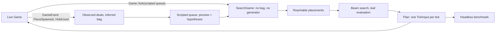

# PILOT implementation plan

An automated player: a mode the player selects from §13.3's menu, which plays
the game itself through the ordinary rules while they watch.

## The name, and the numbers

- The mode is **PILOT**, not ROBOTO. Roboto is Google's typeface, and §1.3
  keeps a trademarked word out of the game entirely rather than beside it —
  the decision that made a four-line clear a `QUAD`. The word appears in
  `spec/PILOT.md`, `src/pilot/`, `src/bin/ftm-pilot.rs` and one menu row, and
  nothing in the tree is renamed for it.
- **`PILOT.md` owns §P1-§P9** and this plan's stages are **P0-P8**. The letter
  is shared deliberately: `GUI.md` owns §G1-§G9 while `EGUI-PLAN.md` has stages
  G0-G13, and the `§` is what tells them apart — "§P4 by P6" reads the same way
  "§G5 by G8" already does. Do not invent a second letter for the stages.
- **Nothing is renumbered.** `PILOT.md` is a fifth document, `FTM.md` §1-§19 do
  not move, and the sections this plan amends keep their numbers. CLAUDE.md's
  four-documents table becomes five in stage P1, in the same commit as the
  first §P number that anything cites.
- `PILOT.md` is normative since P1, and source comments cite `PILOT.md §Pn`
  the way they cite `GUI.md §Gn`.

## Scope and decisions

- G13 is complete and milestone MG7 is accepted. PILOT starts from that
  accepted baseline and changes nothing about it that is not listed here.
- **This is a deliberate amendment to a standing scope rule.** CLAUDE.md says
  "§18 remains out of scope", and §18's first bullet is this feature, filed as
  deferred: *"A self-playing demo driven by a simple heuristic bot is the most
  likely addition; it would need a placement search and would reuse `Game`
  unchanged."* This plan promotes that one bullet and no other. Sound, replays,
  extra modes, per-piece statistics and colour themes stay deferred, and §19
  stays a list of constraints.
- **§18's bullet is amended rather than contradicted.** It imagines the bot as
  the *attract screen's* idle demo; this plan makes it a menu item the player
  chooses, and excludes the idle demo. §18 is rewritten in P1 to say so, so it
  no longer describes something nobody is building.
- §1.1 gains the mode in its feature list, and §1.2 — "the game is
  keyboard-driven" — gains a sentence: PILOT is the one mode where nobody is at
  the keyboard, and the keys that remain live while it plays are the spectator's
  (§7's pause, §10.1's restart and quit), not the game's.
- The first release includes the selectable menu item on the terminal and the
  native window, and a native headless benchmark. It excludes the idle attract
  demo, automated weight training, pointer or touch control, and any path from
  an automated run to §14's table.
- **There is no browser PILOT.** A tab's search would run on the frame thread
  and no requirement asks for it, so the browser's menu does not offer the mode
  (see *Portability* below, which is not the same decision).
- The planner is **fair**: it decides from locked visible cells, the current and
  held pieces, the configured preview queue, and a 7-bag remainder inferred only
  from pieces already observed. This is enforced by a type, not by a convention
  or a test (see *Information and fairness*).
- The planner is **deterministic and takes no clock**: integer weights, canonical
  action ordering, a fixed beam and an integer node budget. It never consults
  elapsed wall time, a frame counter, or anything a front-end knows.

## The decisions this plan rests on

1. **Reuse `Game`, do not write a second simulator.** §18 said so and it is
   right: a private board model would drift from §9's rules — kicks, lock down,
   §9.13's T-spin flag, §9.12's ordering — and the drift would show as a bot
   that plays legally in search and illegally in the game.
2. **Fairness is structural.** A cloned `Game` carries the real generator and
   the real bag; `Game::bag_remaining` (`core/game.rs:337`) is hidden
   information with a public-in-crate accessor. A searcher that holds a `Game`
   is one autocomplete away from cheating silently, and no test would notice
   until someone read the diff. So the searcher never holds a `Game`.
3. **The planner is a pure function of the fair state.** That is what makes
   `tests/pump.rs`'s cadence invariance hold for an automated round, and
   cadence invariance is what proves the mode did not quietly become a
   real-time system.
4. **Something plays early.** G5 hung an empty application on the pump before
   any of it drew a game, and that is why G6-G13 were short. The equivalent
   here is a bot that plays badly on both front-ends at stage P4, before beam
   search, chance nodes or tick-exact reachability exist.
5. **The benchmark comes before the clever search**, because every stage after
   it is an optimisation, and an optimisation without a baseline is a rewrite.

## Architecture



- Add a platform-free top-level `src/pilot/` module with a small public API:
  `Pilot` (the controller), `Settings`, the benchmark's report types, and — as
  P2 found — the three things a caller outside the crate has to be able to
  name: §P2.4's `Knowledge`, §P2.3's `Fork` and §P5's features and weights. It
  is a sibling of `core/` and `shell/`, not a part of either.
- `src/pilot/` may name the core's façade (`core/mod.rs`'s re-exports) and the
  one crate-private search seam below, and nothing else inside `core`. It may
  name `shell::config::RulesConfig`, and nothing else in the shell: the planner
  must not learn what a screen, a key or a stamp is.
- Add the seam as a new `pub(crate) mod search` in `core`, re-exported from
  `core/mod.rs` with `pub(crate) use` — **not** `pub use`. §17.3's A10 is
  therefore unchanged: the core's *public* surface does not grow, and a §19
  client is handed exactly what it was before.

## Information and fairness

The seam is one constructor and one restricted type:

```rust
// core/search.rs, pub(crate)
impl Game {
    /// A fork for search: the same rules and the same board, with the bag
    /// replaced by exactly the pieces the caller supplies.
    pub(crate) fn fork(&self, queue: &[PieceKind]) -> SearchGame;
}
```

- `SearchGame` wraps a `Game` whose randomiser has been **replaced**, not
  merely hidden: it holds a scripted queue and no generator, so there is no
  hidden future inside it to read. When the scripted queue is exhausted it
  refuses to spawn and reports `Exhausted`; the search stops at its own
  horizon because the fork cannot go past it.
- `SearchGame` exposes `tick`, `state`, the board, the current and held pieces
  and the scripted queue's remainder. It does not expose `bag_remaining`,
  `preview` or the inner `Game`. `Game::fork` is the only constructor.
- The caller builds the scripted queue from fair information only: the visible
  preview (exactly `preview_count`, which is what `GameView` shows) followed by
  hypotheses drawn from the inferred bag remainder. Hypotheses are the caller's
  own, so a test that changes the live game's hidden future cannot change a
  plan — and neither can a future maintainer, without deleting a type.
- **Observation is exact and needs no diffing.** `GameEvent::PieceSpawned(kind)`
  (`core/events.rs:135`) names every piece as it is dealt and `HoldUsed` is a
  separate event, so the bag tracker counts deals rather than reconstructing
  them from a changing preview. Seven deals close a bag; the remainder is the
  set not yet seen in the open one.
- A hold swap is not a deal. A swap with an empty hold slot *is* followed by a
  deal, and the event stream says which happened.

## When the planner thinks

This is a rule, not an implementation note, and it is what the mode's
determinism rests on.

- The planner runs **inside the tick that spawns a piece**: the tick whose
  events contain `PieceSpawned` (and nothing else re-plans — a hold in the plan
  is part of the plan). It produces a **plan**: one `TickInput` per tick, from
  the next tick until the piece locks.
- Every following tick pops one input from the plan. A plan is never recomputed
  from a partially executed state, so the live game replays exactly what the
  search simulated.
- **The planner is never amortised across frames and never bounded by wall
  time.** A front-end may pump at 60 Hz, at 144 Hz, twice in a millisecond or
  once after a minute; the plan is the same because it is a function of the
  game's state and the settings alone. Spreading a search over frames would
  make the round cadence-dependent and would break the acceptance check this
  plan sets itself.
- **`App::advance` changes shape.** Today a batch of ticks gives its edge
  actions to the first tick only and `Actions::default()` to the rest
  (`shell/round.rs:602-640`), because a human produces input per frame. A
  planned round needs the batch's *n*th input on the batch's *n*th tick. The
  human path must stay byte-identical — the terminal's mock-ups and
  `tests/pump.rs` say so — so this is a branch inside `advance`, not a
  rewrite of it.
- A batch may be up to `MAX_CATCH_UP_TICKS` ticks after a stall, and may
  therefore contain more than one spawn. The node budget is sized so that a
  full catch-up batch of searches still fits in a frame; this is measured in
  P5, not assumed.
- **Input honesty.** A `TickInput` may legally shift ten cells at once
  (`shift_cells: u8`) and carry four actions. PILOT is capped at **one action
  and at most one shift cell per tick** — still 60 cells a second, but a piece
  that travels rather than teleports, which is what §12.5's hard-drop trail and
  lock flash are drawn for. The cap is normative in §P3 and is a test.

## Search and evaluation

- Score immediate outcomes from the core's own events and score deltas. Apply
  the full board evaluation **only at leaves**, so a persistent defect is not
  charged once per ply.
- Integer weights and integer features throughout, in the house style of §9.9's
  16.16 gravity: no floating point anywhere in the planner, so a plan is
  identical on every target and in every build profile.
- Begin with completed clears, holes, covered-hole depth, aggregate and maximum
  height, bumpiness, row and column transitions, blockades, wells, top-out,
  combo and back-to-back state, and perfect clears. Keep feature extraction and
  weights independent structures; weights are hand-tuned at first and automated
  tuning is not in this plan.
- **Depth is clamped by `preview_count`**, which §6.3 allows to be 1. At
  `preview_count = 1` the search reaches a chance node at the second ply, so the
  expected/worst-case blend is load-bearing in an ordinary configuration rather
  than an edge case. Two plies is the default; a deeper setting costs nodes and
  is the benchmark's business.
- Beyond the visible horizon, branch uniformly over the inferred bag remainder
  and combine expected and worst-case values at an integer 80/20 ratio. The
  hypotheses are the caller's; the fork has no others to offer.
- Deduplicate intermediate states by pose, lock state, rotation metadata, hold
  state and queue position; deduplicate terminal outcomes by board, hold and
  queue. Cache subtrees by board, current and held piece, scripted queue,
  inferred remainder and remaining depth.
- Resolve equal evaluations by lower top-out risk, then fewer inputs, then
  canonical action order, so every machine chooses the same move.
- **The node budget is an integer count, and exhausting it returns the best
  fully evaluated move.** A partially evaluated branch is never chosen: that is
  what keeps the answer independent of where the count happened to run out.

### Cost, which is a design constraint rather than an optimisation

- A fork copies a 400-byte matrix and allocates; `GameEvent::LinesCleared`
  allocates a `Vec` per clear. At one search per piece this is nothing; at
  benchmark rates it is the whole cost. Reuse one event buffer in the searcher,
  exactly as `App` does (`shell/round.rs:283`), and pool forks if the benchmark
  says it matters.
- **Replay verification is a debug-mode check, not a production cost.** "Replay
  the chosen sequence against an untouched fork and compare" doubles the work
  for a property that is either a bug or nothing, so it is `debug_assert`-shaped
  and always on in tests and in the benchmark's debug build. The live round gets
  it for free anyway: a plan that diverges from its prediction is caught by the
  same assertion as it is consumed.

## Portability

- `src/pilot/` is **platform-free and compiles on every target**: no `Instant`,
  no `std::fs`, no `rand::random`, no calendar, and no `cfg(target_arch)`. It
  joins `make shell` and `make portable` in P2, and those two are the compiler
  holding the "no clock" rule that the cadence acceptance check depends on.
- That is not the same decision as offering the mode in a browser. The module
  compiles for wasm32; the tab's menu does not list PILOT, because
  `Session::menu` is a runtime list and "a screen offers what its front-end can
  do" is already how this is said. No `cfg` is involved, and no code is dead:
  the enum variant exists everywhere and one list omits it.
- `src/bin/ftm-pilot.rs` is native-only, gated like `src/native.rs` — a
  benchmark needs an argv and a clock. `default-run = "ftm"` is unchanged, and
  `cargo check --no-default-features`, `make portable` and `make web-check`
  must all stay green.

## Shell and front-end integration

- **`MenuChoice` gains `Pilot`**, sitting under `Play`. `MenuChoice::ALL`
  becomes six items — the terminal's and the native window's — and the tab's
  list stays at four. Rename `MenuChoice::NO_QUIT` to **`MenuChoice::CANVAS`**
  in the same commit: it is no longer "the same list without quit", it is the
  browser's list, exactly as `Setting::CANVAS` is the browser's panel.
- **`Next` carries the player.** `Next::Play` becomes `Next::Play(Player)` with
  `Player::{Human, Pilot}` (§7, settled in P1), so the attract screen's choice
  is what `Round::new` reads and a restart carries rather than rediscovers.
- `App` gains the controller beside the input state, and `play_key` drops
  gameplay bindings while it is present. Pause, the pause menu, §10.1's restart
  hold, the Options panel, the controls box and quit all stay live: a spectator
  can stop, look and leave.
- **The pause menu's Restart keeps the mode.** A `Phase` that carries it is the
  simplest way; a restart out of a PILOT game must not silently hand the player
  a game they are not holding the keyboard for.
- **Losing the keyboard still pauses**, as `GUI.md` §G4.7 has it. The player
  was not typing, but the rule is the same rule, a paused game blanks the stack
  under §9.17 either way, and it stops a backgrounded window spending a search
  budget per frame. Written into §P6 rather than inherited by accident.
- **No automated run reaches §14's table.** The suppression goes beside the
  seeded-run rule in `App::finish` (`shell/round.rs:528`), which is already the
  one place that knows a run's provenance, and `Session::recent` must stay
  `None` so the attract screen highlights nothing.
- **What ends an interactive PILOT game** is the spectator, a top out, or
  nothing: a good planner may not top out for hours. §P6 states it plainly and
  there is no piece cap on the interactive mode; the benchmark has one.
- An unambiguous indicator on both playing screens (`tui/playfield.rs`,
  `gui/playfield.rs`) so a screenshot of a PILOT game can never be mistaken for
  a player's.
- **Layout, measured before it is promised.** The terminal's attract block is
  21 rows against §12.1's 24-row minimum (`tui/attract.rs:57`), so a sixth menu
  row fits with two to spare. The window reserves a five-row band
  (`gui/attract.rs:48-64`) and its footer sits on row 22 of §G3's 24-row grid:
  a sixth row puts the footer on the last row. Check that before committing to
  the row; the alternative is one fewer blank row above the panel. §12.1's and
  §G3.3's minimums do not move either way.
- Update the exact terminal mock-up tests and the GUI layout and render
  fixtures rather than weakening them.

## Headless benchmark

- `src/bin/ftm-pilot.rs`: no render, native, over the same controller the
  interactive mode uses.
- Arguments: a seed range or count, a piece cap, depth, beam width, node budget,
  and text or JSON output.
- **It pins the rules itself and never reads §6.2's config file.**
  `preview_count` alone changes how well the bot plays, so a baseline that
  depended on whoever ran it would compare nothing. It takes `--preview`,
  `--start-level`, `--hold`, `--rot180` and `--lock-down` with the spec's
  defaults, and prints the resolved `RulesConfig` in the report header.
- Reports score, lines, pieces, top-out rate, nodes searched and placements per
  second. Wall-clock throughput is reported; **acceptance limits use node
  counts**, which are deterministic.
- Checked-in fixed seed sets for comparing evaluator and search changes.
- **Plan snapshots live in their own file and are expected to churn.** A weight
  change moves them by design, which is the opposite of what
  `tests/snapshots/scripted_game.txt` is for. The I1 snapshot and §19.4's
  batch-invariance canary must not move at any stage of this plan, and a stage
  that moves one has found a bug.

## Delivery stages

### P0 — Accepted baseline

Complete. `EGUI-PLAN.md` G13 and B1-B12 are signed off; the two front ends,
`tests/pump.rs`, `tests/gui_render.rs` and the mock-up tests are the fixed
baseline.

### P1 — Specification and contracts ✅

Done, and docs only: no code was written, and `src/` is byte-identical.

- `PILOT.md` is normative, §P1-§P9, with §P9's C1-C13 table.
- `FTM.md` §1.1, §1.2, §4, §7, §14, §15.4 and §18 amended; `TUI.md` §13.3 and
  §12.4, `GUI.md` §G4.5, §G4.7, §G7.4, §G7.5 and §G8.1 amended; CLAUDE.md's
  document table, scope rule and invariants. Nothing renumbered.
- `pilot::Pilot`/`Settings` (§P3.4) and the `Game::fork`/`SearchGame` seam
  (§P2.3) are written down as signatures.

**What it settled.**

- **`Next::Play(Player)`**, with `Player::{Human, Pilot}` — the payload rather
  than a fourth `Next` variant, because every front-end already matches `Next`
  exhaustively and a restart has to *carry* the player rather than rediscover
  it. §7's table gained one row and its diagram none.
- **The indicator is `PILOT`, left-aligned on the status row**, for the whole
  game rather than transiently, in both front-ends. The centred status content
  is the longest thing that could collide with it and does not: `PERFECT CLEAR`
  is 13 characters and centres well clear of column 5.
- **The two layouts were measured on the running binaries, not reasoned about,
  and they disagreed.** The terminal's attract block must grow from 21 rows to
  22: with six menu items the footer line falls out of the block *silently*, by
  clipping, which is exactly what a spec written from arithmetic would have
  promised away. The window needs no change at all — §G7's menu band is five
  rows reserved whatever the menu's length, so six items centre into the blank
  rows either side and neither the panel nor the footer moves. Both are in
  `PILOT.md` §P7.2, and the screenshot is what settled the second.
- **`MenuChoice::NO_QUIT` becomes `CANVAS`** in P4, for the reason in §P7.1.

### P2 — Knowledge, evaluation, and the fork ✅

- `Game::fork` and `SearchGame`, with the exhaustion behaviour and a test that
  a fork has no reachable hidden future.
- Bag observation from `PieceSpawned`/`HoldUsed`; bag-boundary and remainder
  inference, unit-tested against hold swaps and short previews.
- Board features and the integer evaluator, unit-tested one feature at a time.
- `src/pilot/` joins `make shell` and `make portable`.

**What it settled.**

- **The randomiser is replaced one level lower than expected.** `core/bag.rs`
  now holds a `Source` of two kinds — §9.6's generator with the bag it
  shuffles, or a scripted list — rather than a `Game` that keeps its bag and
  agrees not to ask it. `Bag::next_piece` returns `Option`, and the `None` is
  reachable only from a fork. §17.2's I1 snapshot and §19.4's canary did not
  move, which is the assertion rather than a convenience.
- **An exhausted fork waits in the entry delay.** It is not over and has not
  topped out, so a search can tell "I have run out of knowledge" from "the game
  ended", which is a distinction P6's leaf evaluation depends on. §P2.3 says so
  now.
- **A stage that lands a seam lands only the part of it that is read**, because
  `#![allow(dead_code)]` is gone and the tree means it. §P2.3's method list is
  an upper bound rather than a shopping list, and is amended to say so: P2 has
  `tick`, `state`, `view`, `scripted` and `exhausted`, and the pose and hold
  state arrive with P3's generator.
- **`pilot::Fork` exists because a crate-private type cannot appear in a public
  signature.** That is structural and permanent, not a lint workaround: §P2.3
  requires `SearchGame` to stay out of the core's façade, so `tests/` and §P8's
  runner search through `pilot`'s own wrapper. It is also where the *queue*
  arrives, which is the half of fairness a type cannot hold.
- **The first piece is the deal no event mentions**, and the bag closes on the
  seventh rather than the eighth. Both are in §P2.4 now; both were bugs first.
- **A preview can cross a bag boundary**, so a piece on the screen may also be
  a legitimate hypothesis — which is not an edge case at the default preview of
  5, and cost a test assertion that was simply wrong about §9.6.
- The evaluator's starting weights are provisional and say so. Two judgements
  they already have to get right are tested: a clean stack beats the same stack
  with a hole in it, and no board is worth a top out.

### P3 — Placements, one ply ✅

- Hard-drop placement generation: rotate at spawn, shift, drop — the simple
  generator `PILOT.md` recommends starting from, honouring the one-action,
  one-cell-per-tick cap.
- One-ply choice with canonical ordering and the tie-breakers.
- Plan replay verification as a debug assertion.

**What it settled.**

- **A placement is played, not predicted.** Every candidate is replayed through
  the real rules on a fork and measured from the board it leaves behind, so
  there is no arithmetic anywhere about where a piece lands. That is what makes
  a rotation that kicks at a high stack, a shift that runs into a wall and a
  piece that gravity locks early all ordinary rather than special cases — and
  it is why `SearchGame` gained nothing this stage. §P2.3 expected the pose and
  the hold state here; a generator that replays reads the position from
  `view()` and wants neither. Both sections are amended.
- **The plan is truncated at the tick that locks the piece**, whichever tick
  that is. An input after the lock is one the *next* piece receives, which is
  the divergence §P3.1 forbids rather than a plan. The fork is what knows.
- **The divergence assertion found the one thing it could not compare, on its
  first run.** A hold at a `preview_count` of 1 uses the fork's queue up, so the
  tick that locks the piece cannot say what spawns after it — the live game
  deals a piece that was hidden when the plan was made. The prediction carries
  whether the fork still knew, and the comparison stops exactly there: the
  board, the figures and the hold slot always, the next piece only when it was
  not past the horizon. The assertion is worth its keep already.
- **It does not play badly.** P4 says to expect that, and it was wrong: one ply
  over §P5's starting weights plays **20,000 pieces on each of five seeds
  without a top out**, ~8,000 lines and level 800 each. So the lookahead of P6
  has a harder baseline to beat than the plan assumed, and P5's benchmark is
  what will say whether it beats it at all.
- **The cost, measured, and it is P5's starting figure.** ~104 candidates per
  piece — two hold choices × four orientations × thirteen columns — at about
  155 µs a piece in release, or **~6,500 placements a second** on this machine.
  A frame is 16 ms, so a full `MAX_CATCH_UP_TICKS` batch is nowhere near it
  even at one search per tick; the number to check in P5 is the one after P6's
  second ply, not this one.
- **`Settings` is landed unread.** `Pilot::new`'s signature is §P3.4's, and a
  settings-shaped argument that arrives two stages later is a signature that
  changes under its callers. `settings()` is what reads the field — §P8's
  report header is who will want it.

### P4 — It plays ✅

- `MenuChoice::Pilot`, the `CANVAS` rename, `Next` carrying the mode, the
  controller inside `App`, the per-tick input path in `advance`, spectator
  controls, no high scores, the indicator on both playing screens.
- Terminal mock-ups and GUI render fixtures updated.
- At the end of this stage a person watches it play on both front ends. It is
  expected to play badly.

**What it settled.**

- **It was watched on both front ends, and it does not play badly.** P3 already
  said so headlessly; this is the same finding with a screen in front of it.
  The terminal at seed 42 had **14 lines and level 2 within six seconds** of the
  menu, and the window the same, and neither looked like a machine flailing —
  the pieces travel rather than teleport, which is §P3.2's cap being a
  presentation decision as much as an honesty one. The sentence above is left
  as it was written: what P4 expected is part of what P4 found out.
- **The planner's branch is four lines inside `advance`, and the human path is
  byte-identical.** The batch is where the two differ (§P3.1) — the same six
  ticks as one batch and as six give the same board, which is the cadence
  invariance of §P9's C4 reached from the inside, and `tests/pump.rs` now runs a
  whole PILOT round at 60 Hz, 144 Hz and a jittery cadence to say it from the
  outside. `observe` is handed the slice of the shared event buffer that tick
  appended, because the buffer belongs to the frame and §12.5 absorbs all of it.
- **Two amendments the stage was not expecting, and both were the spec's.**
  §13.3's panel cycle pauses on any item but the two that *start a game*, so
  PILOT had to join PLAY — and the index that answers it is a front-end's list's
  (`MenuChoice::CANVAS` has no PILOT at all), so `Attract` remembers the item the
  cursor is on rather than only where it is. And §12.4 and §G4.5 both say the
  indicator is drawn in the `I`-piece cyan, which the first implementation was
  not; it is now, in both front-ends, and the colour is asserted in both.
- **The spectator's keys are dropped at the input boundary, not downstream.**
  §P7.3 says the gameplay keys do nothing, and the cheap way to read that is
  "ignore what they produce". That would have left a held direction charging DAS
  and a press resetting a lock-delay timer behind a game nobody is playing — the
  reason §10.1 drops a disabled mechanic's key where it does. Pause, the pause
  menu and everything reachable from it, §10.1's restart hold, quit and Ctrl-C
  are what stay live.
- **`Next::Play(Player)` cost less than the menu did.** Every front-end already
  matched `Next` exhaustively, so the payload was a compiler-guided edit; the
  sixth menu item is what reached into `tui::attract`'s block height, the two
  render fixtures and three of the shell's own tests. §P7.2's measurement was
  right on both counts — the terminal's block went 21 → 22 rows and the window
  needed nothing — and the assertion that would have caught the silent clipping
  was already there: the footer line is the last row of the block, and
  `the_screen_holds_the_wordmark_the_menu_and_the_panel` looks for it.
- **The window is still awkward to drive, and the awkwardness is focus.** Three
  of five scripted runs sent their keys to whatever was in front instead —
  `osascript` reports success either way, exactly as `EGUI-PLAN.md` G13 recorded.
  What works is one shell invocation that launches the binary, waits, sends the
  keys and screenshots, with nothing in between to steal the foreground.

### P5 — Headless benchmark

- The runner, the stable text and JSON reports, argument and schema tests, a
  small deterministic smoke batch for `cargo test`, and a documented
  release-mode baseline command with its recorded result.
- Measure the per-piece search cost, including a full `MAX_CATCH_UP_TICKS`
  batch, and record the node budget that fits a frame.

### P6 — Lookahead

- Leaf evaluation, two-ply search, beam pruning, the transposition cache,
  chance nodes over the inferred remainder, and the 80/20 blend.
- The node budget and the best-fully-evaluated-move rule.
- Fixed-seed plan snapshots, and the hidden-future isolation test.
- Report the improvement against P5's baseline, in the commit message.

### P7 — Exact reachable placements

- Breadth-first search over forks using legal `TickInput`s: hold, both quarter
  turns, optional 180, shifts, gravity, lock delay, soft and hard drop, SRS wall
  and floor kicks, and same-tick ordering at high gravity.
- Normalised state keys and outcome deduplication.
- Fixtures for kicks, tucks, spins, hold-empty and hold-occupied paths, disabled
  mechanics, high gravity, Block Out and Lock Out.
- Report the improvement against P6's baseline. If it buys nothing measurable,
  say so in the commit message and keep it anyway for the placements a
  hard-drop generator cannot reach.

### P8 — Acceptance

§P9's table, checked one criterion at a time in the house style — each with how
it was checked, not merely that it was.

| | Criterion | How it is checked |
|---|---|---|
| C1 | Build clean | `make check`, silent. |
| C2 | Fair | Changing the live game's hidden future, with visible information held constant, does not change a plan — and `SearchGame` has no accessor that could. |
| C3 | Deterministic | The same seed and settings give the same game twice, on the host and under `make portable`'s target; integer arithmetic throughout. |
| C4 | Cadence-invariant | A PILOT round at 60 Hz, 144 Hz and a jittery cadence with empty frames gives a byte-identical `GameView`, in `tests/pump.rs`. |
| C5 | Legal | Every chosen path replays through unmodified rules, and no `TickInput` exceeds one action and one shift cell. |
| C6 | Rules honoured | Hold and 180 rotation both on and off; `preview_count` 1 and 6. |
| C7 | Not recorded | A PILOT top out reaches neither §14's table nor §13's panel. |
| C8 | Spectator controls | Pause, the pause menu, restart, Options, Controls and quit, on both front ends. |
| C9 | Terminal | `tools/drive.py`: the menu row, a game started and watched, the indicator on screen. |
| C10 | Window | `osascript` keys to the menu row and `screencapture` of the result; the handoff to a paused game when focus is stolen. |
| C11 | Benchmark | Fixed-seed reports reproduce byte for byte; recorded node counts and throughput. |
| C12 | Watched | A person watches a full game on each front end and judges that it plays sensibly. No test in the tree can see this. |
| C13 | Baseline intact | I1's snapshot and §19.4's canary unmoved; the terminal's output byte-for-byte what it was outside the menu row. |

## Completion criteria

PILOT is complete when both native front ends can start and watch the same
automated mode, the headless runner reproduces fixed-seed reports, the planner
provably cannot see hidden pieces or a clock, every chosen path replays through
the unmodified rules, no automated run is ever recorded, and C1-C13 are signed
off one by one.

## Open decisions

All three of P1's are settled — see P1 above. What is left is for later stages
to answer with evidence rather than now:

- **The node budget** (§P6.4). P5 measures it, including a full
  `MAX_CATCH_UP_TICKS` batch of searches in one pump, and the number goes in
  §P6 when it is known rather than guessed.
- **Whether exact reachability (P7) is worth its cost** over the simple
  generator. P6's baseline is what answers it; if it buys nothing measurable,
  say so and keep it for the placements a hard drop cannot reach.
- **The starting weights** (§P5). Hand-tuned, and the benchmark is what says
  whether a change helped. Automated tuning stays out of this plan.
